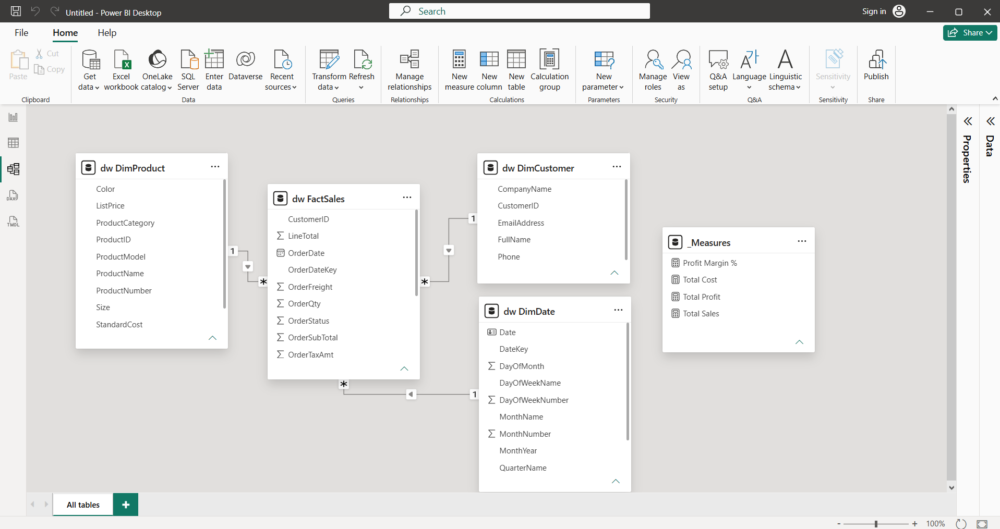
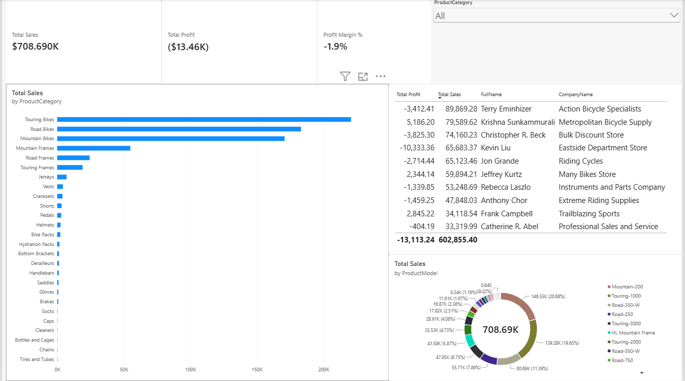

# End-to-End Enterprise Data Pipeline & Analytics on Azure

Automated, cloud-native ELT pipeline and dimensional warehouse built on Microsoft Azure, featuring Infrastructure as Code (IaC), raw landing ingestion, T-SQL staging/transformations, a Star Schema semantic layer, and Power BI reporting versioned via PBIP.

---

## 🏛️ Architecture Overview

The pipeline processes transactional retail data (`AdventureWorksLT`) through five decoupled stages:

1. **Infrastructure as Code (IaC):** Automated provisioning of Azure Resource Groups, Azure SQL Server, and Azure Blob Storage via ARM Templates and Bash orchestration (`deploy.sh` / `destroy.sh`).
2. **Raw Data Ingestion (Landing):** Direct operational extraction and ingestion to Azure Blob Storage containers using AzCopy / Azure CLI.
3. **ELT & Data Quality:** Batch staging using T-SQL `BULK INSERT` with `MERGE` statements for idempotent upserts.
4. **Dimensional Modeling (Star Schema):** Creation of a decoupled analytical layer under the `dw` schema:
   - `dw.FactSales`: Transactional line-item metrics.
   - `dw.DimCustomer`, `dw.DimProduct`: Conformed dimension views abstracting OLTP normalization.
   - `dw.DimDate`: Programmatically generated calendar dimension (2005–2030) supporting Time Intelligence DAX.
5. **Business Intelligence Layer:** Executive semantic model and dashboard built in Power BI Desktop, version-controlled using Git-friendly `.pbip` metadata format.

---

### 📐 Dimensional Data Model (Star Schema)
The analytical layer implements a Kimball-style Star Schema with single-direction 1:* relationships and an isolated `_Measures` table:



---

### 📊 Business Intelligence & Reporting
The Power BI executive dashboard surfaces profitability anomalies, product category distribution, and top client contribution:




## 🛠️ Tech Stack & Tooling

- **Cloud Platform:** Microsoft Azure (SQL Database, Blob Storage, Resource Groups)
- **IaC & Automation:** Bash, Azure CLI, ARM Templates (`azuredeploy.json`)
- **Data Warehousing & Querying:** T-SQL, DBeaver, Star Schema Modeling
- **Analytics & Semantic Layer:** Power BI Desktop, DAX, PBIP format

---

## 📂 Repository Layout

```text
├── bi/
│   └── reports/
│       ├── AdventureWorks_Analytics.Report/       # Visual layout and report pages
│       ├── AdventureWorks_Analytics.SemanticModel/ # DAX measures, tables & model definitions
│       └── AdventureWorks_Analytics.pbip          # Power BI Project root file
├── data/
│   ├── AdventureWorksLT.bacpac                    # Base transactional database backup
│   ├── download_sample_data.sh                    # Extraction script for raw data
│   └── ventas_nuevas.csv                          # Incremental landing dataset
├── docs/
│   ├── bi_dashboard_preview.png                   # Executive dashboard screenshot
│   └── star_schema_model.png                      # Power BI dimensional model diagram
├── iac/
│   ├── deploy.sh                                  # Automated provisioning & orchestration
│   ├── destroy.sh                                 # Teardown script for Azure resources
│   ├── parameters.example.json                    # Template parameter definitions
│   ├── parameters.local.json                      # Local dynamic credentials (git-ignored)
│   └── template.json                              # ARM template for SQL & Storage
├── sql/
│   └── dw/
│       └── 01_create_star_schema.sql              # Views (Dimensions/Facts) & DimDate table
├── .gitignore                                     # Ignores sensitive local credentials
└── README.md